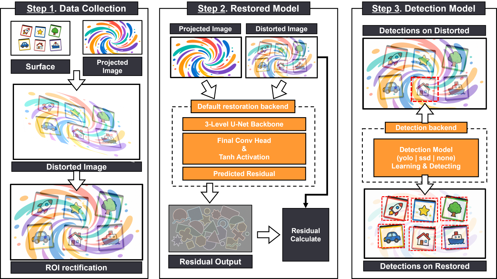

# ProRes-Det

**Pro**jector **Res**toration + **Det**ection

스크린을 향한 카메라는 프로젝터가 쏘는 빛까지 함께 담는다. 이 프레임워크는 그 빛을 제거하고,
제거 전과 후의 객체 검출 성능을 측정한다.

복원 모델과 검출기 모두 작은 인터페이스 뒤에 있어, 파이프라인을 건드리지 않고 교체할 수 있다.


두 모드 모두 같은 `(distorted, light)` 프레임 쌍으로 수렴하므로 그 이후는 전부 공유된다.
`evaluate.py`는 복원 단계의 양쪽에서 검출기를 돌려 그 차이를 점수화한다 — mAP, PSNR, SSIM.

| 문서 | 담당 |
|---|---|
| [README_running.ko.md](README_running.ko.md) | `demo.py` · `evaluate.py` · `train.py` — 모든 옵션, 입력, 출력 |
| [projector_distortion/README_code.ko.md](projector_distortion/README_code.ko.md) | 모듈별 책임, 호출 그래프, 공개 API |
| [data/README_data.ko.md](data/README_data.ko.md) | 세 개의 split, 구조, 파일명 규칙, 라벨 포맷 두 가지, `Data.py` 전 스테이지 |
| [weights/README_weights.ko.md](weights/README_weights.ko.md) | 체크포인트 3개, 체크포인트 포맷, residual 규약 |

---

## 1. 설치

Python 3.9 이상.

```bash
git clone <repo> && cd ProRes-Det
conda create -n prores-det python=3.10 -y && conda activate prores-det

pip install -e ".[all]" -r requirements-cuda.txt    # GPU
pip install -e ".[all]"                             # CPU만
```

대괄호는 따옴표로 감쌀 것. zsh에서는 glob 문자다.

`[all]`은 모든 extra를 포함한다. 좁은 것도 있다: `yolo` 검출기용 `[yolo]`, `train.py`용
`[train]`, 非Windows `--live`용 `[live]`, pytest용 `[test]`.

GPU 적용 확인:

```bash
python -c "import torch; print(torch.__version__, torch.cuda.is_available())"
# 2.9.0+cu128 True
```

`requirements-cuda.txt`가 필요한 이유는 Windows에서 기본 PyPI `torch`에 CUDA가 없기
때문이다. 모든 엔트리포인트가 첫 줄에 결정된 디바이스를 출력하므로, CPU로 떨어진 실행은 바로
드러난다.

---

## 2. 실행

```bash
python demo.py                    # 번들 22쌍 복원 + 검출 → output/<timestamp>/
python evaluate.py                # 전후 mAP + PSNR/SSIM  → output/Eval_<dataset>/
python train.py --epochs 30       # 복원기 재학습         → runs/<tag>/
python demo.py --live             # 웹캠 + 프로젝터 리그   → output/<timestamp>/
python Data.py capture_warp       # 직접 수집 (아래 참고)  → data/Create_Data/warp_<MMDD>/
python Data.py record --screen 2  # 투사 + 녹화, 모델 없음 → data/recordings/
```

앞 세 개는 인자가 필요 없다. 샘플 데이터와 체크포인트 3개가 git에 추적되므로 클론 직후 바로
돌아간다. editable 설치를 하면 `pdf-demo` · `pdf-evaluate` · `pdf-train`도 PATH에 올라간다 —
같은 세 스크립트를 감싼 얇은 래퍼다.

번들 데이터셋은 `data/SampleData/` 아래 세 갈래로 분할되어 있고, 각 진입점이 자기 split을
기본값으로 쓴다:

| Split | 내용 | 기본값인 곳 |
|---|---|---|
| `sample_train` | 1,000쌍, 20장면, 라벨 없음 | `train.py` |
| `sample_eval` | 22쌍, 10장면, 박스 107개 | `demo.py`, `evaluate.py` |
| `sample_test` | 200쌍, 5장면, 박스 53개 | 홀드아웃 — `--input`/`--gt`로 지정해야 도달 |

장면이 겹치지 않으므로 `sample_train`으로 학습한 모델은 본 적 없는 프레임에서 채점된다.
자세한 내용과 라벨 포맷 두 가지: [data/README_data.ko.md](data/README_data.ko.md).

**저장소 루트에서 실행할 것.** config 경로는 프로젝트 루트 기준으로 해석되지만, `train.data`
glob은 작업 디렉터리 기준으로 읽힌다.

모델을 바꿔도 입출력 경로는 그대로다. 플래그가 아니라
[configs/detection.yaml](projector_distortion/configs/detection.yaml) 한 줄 수정이다:

```yaml
detector:
  backend: ssd      # ultralytics 불필요
  # backend: none   # 복원만
```

```bash
python demo.py --limit 5          # 앞 5쌍만
```

`--live`는 웹캠과 프로젝터가 필요하다. 어느 모니터에 투사할지, 어느 웹캠이 볼지,
프로젝터→카메라 지연이 얼마인지는
[configs/live.yaml](projector_distortion/configs/live.yaml)에서 온다. 실행마다가 아니라
머신마다 한 번 설정한다. 모니터 표는 시작할 때 출력되므로 `rig.screen`이 틀려도 실행 한 번
버리면 고칠 수 있다:

```
2 monitor(s) detected:
      screen 0 -> 2560x1440 at (0,0) (primary)  \\.\DISPLAY1
      screen 1 -> 1920x1080 at (2560,0)         \\.\DISPLAY2
```

```yaml
# projector_distortion/configs/live.yaml
rig:
  screen: 1
  camera: 0
  offset: 6      # 프로젝터 → 카메라 지연, 프레임 단위
```

앞의 둘은 `--screen`·`--camera`로 실행 한 번만 덮을 수 있다. 잘못 짚었을 때 파일을 고치는
대신 이걸로 끝난다:

```bash
python demo.py --live --screen 2
```

모든 옵션과 입출력: [README_running.ko.md](README_running.ko.md).

직접 데이터를 수집하는 것은 `Data.py`이고, `data/` 아래 스크립트로 분기한다:

```bash
python Data.py                          # 스테이지 목록
python Data.py check                    # 모니터 + 웹캠. 제일 먼저
python Data.py make_light               # 영상 -> 투사할 light 프레임
python Data.py capture_warp --screen 2  # 투사·촬영·정류: 10장면 × 50 = 500쌍
```

`capture`와 `warp`를 따로 돌릴 수도 있다. 그래야 리그 없이 기하를 다시 잡을 수 있다. 전부
`data/Create_Data/` 아래로 떨어지고 `--input`·`--data-root`에 바로 쓸 수 있다. 스테이지·플래그·
세션 구조: [data/README_data.ko.md](data/README_data.ko.md).



1단계는 `Data.py`, 2단계는 `train.py`와 복원기, 3단계는 `demo.py`와 `evaluate.py`다.
동봉된 샘플 데이터가 1단계 산출물을 이미 담고 있어, 클론하면 2단계부터 시작한다.

---

## 3. 구조

```
ProRes-Det/
├── demo.py                   복원 → 검출, 엔드투엔드 (오프라인 / --live)
├── evaluate.py               검출 전후 비교 + 복원 품질
├── train.py                  복원 모델 파인튜닝
├── Data.py                   데이터셋 수집: data/ 전 스테이지의 단일 진입점
├── setup.py  requirements.txt  requirements-cuda.txt  LICENSE
│
├── projector_distortion/     라이브러리 → README_code.ko.md
│   ├── configs/              기본 설정 (YAML)
│   ├── models/               복원 + 검출 모델
│   ├── pipeline/             오프라인 / 라이브 실행 루프
│   └── utils/                이미지, 시각화, 기록, 디스플레이 헬퍼
│
├── tests/                    pytest 스위트, 118개
├── weights/                  체크포인트 3개, 51 MiB, git 추적
├── data/                     SampleData/ (train · eval · test), live/ 클립, 그리고
│                             Data.py가 구동하는 수집 스크립트들. 추적 349 MiB
├── Image/                    위 그림 2장
└── output/                   실행 산출물 (git 무시)
```

모듈별 책임과 서로를 호출하는 방식:
[projector_distortion/README_code.ko.md](projector_distortion/README_code.ko.md).

---

## 4. 설정

```
configs/*.yaml  <  CLI 플래그
```

| 파일 | 내용 |
|---|---|
| [configs/restoration.yaml](projector_distortion/configs/restoration.yaml) | 복원 백엔드와 가중치, 입력 크기, 구조 토글, 학습 하이퍼파라미터, 손실 가중치, 학습 데이터 경로 |
| [configs/detection.yaml](projector_distortion/configs/detection.yaml) | 백엔드, 백엔드별 가중치, conf 임계값, 박스 크기 필터, 17개 클래스명 — LabelMe 라벨의 클래스 *이름*도 이 목록과 대조된다 |
| [configs/live.yaml](projector_distortion/configs/live.yaml) | `--live` 리그: 모니터, 웹캠, 카메라 백엔드, 프로젝터→카메라 지연, 캘리브레이션 검토 여부 |
| [configs/collect.yaml](projector_distortion/configs/collect.yaml) | `Data.py`가 읽는 전부: 세션 폴더, light 추출, 촬영 리그, 워프 기하, 녹화 |

모델 설정은 이 파일에서 바꾼다. 여기에 대응하는 CLI 플래그는 없다. 남은 플래그는 *이번
실행*에 관한 것들이다 — 어떤 데이터, 출력 위치, 얼마나 처리할지 — 여기에 `demo.py`의
`--device`와 `train.py`의 학습 하이퍼파라미터 3개가 더해진다. 모델에 관한 건 전부 파일을
직접 고친다:

```yaml
# projector_distortion/configs/detection.yaml
detector:
  backend: ssd
  conf: 0.4
```

config 안의 상대 경로는 프로젝트 루트 기준으로 해석된다. 단 `train.data`의 세 항목은
예외다. 그대로 glob되므로 작업 디렉터리 기준으로 읽힌다.

---

## 5. 모듈 교체

### 검출기 추가

```python
from projector_distortion.models.base import BaseDetector, Detection, register_detector

@register_detector("mydet")
class MyDetector(BaseDetector):
    name = "mydet"

    def __init__(self, weights, class_names=None, conf=0.25, device="cpu", **_):
        super().__init__(class_names or [], conf, device)
        self.net = load_my_model(weights)

    def detect(self, bgr):
        return [Detection(cls_id, self.label_of(cls_id), score, (x1, y1, x2, y2))
                for cls_id, score, (x1, y1, x2, y2) in self.net(bgr)]
```

이게 변경 사항 전부다. `configs/detection.yaml`의 `detector.backend: mydet`이 즉시 동작하고, 파이프라인·기록·평가 코드는
그대로다.

### 복원기 추가

같은 모양에 레지스트리 하나 더:

```python
from projector_distortion.models import BaseRestorer, register_restorer

@register_restorer("myrest")
class MyRestorer(BaseRestorer):
    name = "myrest"

    def __init__(self, weights, device="cpu", input_size=(640, 360), **_):
        self.input_size = tuple(input_size)
        self.net = load_my_model(weights)

    def restore(self, distorted_bgr, light_bgr):
        restored = self.net(distorted_bgr)            # `light`은 제공될 뿐, 필수 아님
        return restored, residual_or_zeros
```

config가 가리키게 하면 바로 돈다:

```yaml
# projector_distortion/configs/restoration.yaml
model:
  backend: myrest
  weights: path/to.pt
```

백엔드 이름과 체크포인트 둘 다 config에서 온다. 어느 쪽도 플래그가 없다.

`light`(그 순간 프로젝터가 쏜 프레임)을 모든 복원기에 넘기는 이유는, 그것이 ProCam 리그에는
있고 일반 복원 환경에는 없는 유일한 신호이기 때문이다. 단일 이미지 백엔드는 그냥 무시하면
된다.

두 번째 반환값은 residual 뷰다. surface 이미지를 직접 예측하는 백엔드는 여기에 0을 넣으면
된다. 패널의 residual 타일과 `residual_mean`만 의미를 잃고, 채점은 그대로 된다.

기본 네트워크는 surface 이미지가 아니라 **빼낼 residual**을 예측한다:

```
input   (B, 6, H, W) = cat([distorted, light])  in [-1, 1]
output  (B, 3, H, W) = residual
restored = (distorted - residual).clamp(-1, 1)
```

이 규약이 왜 중요하고 손실 함수가 어떻게 강제하는지:
[weights/README_weights.ko.md](weights/README_weights.ko.md#residual-규약).

---

## 6. 테스트

```bash
python -m pytest -q
```

---

## 7. 라이선스

MIT. [LICENSE](LICENSE) 참고.

---

[English](README.md)
