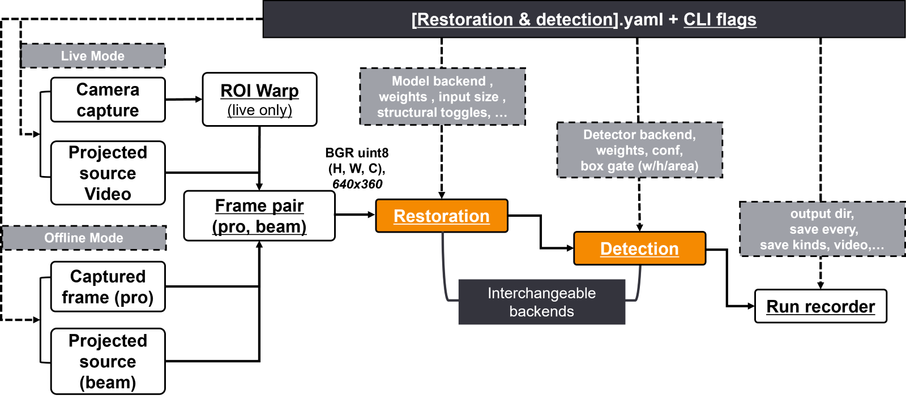

# ProRes-Det

**Pro**jector **Res**toration + **Det**ection

A camera pointed at a screen sees whatever the projector throws on it. This framework
removes that light, then measures object detection before and after the removal.

The restoration model and the detector both sit behind small interfaces, so either can be
swapped without touching the pipeline.



Both modes converge on the same `(distorted, light)` frame pair, so everything downstream
is shared. `evaluate.py` runs the detector on both sides of the restoration step and scores
the difference — mAP, PSNR, SSIM.

| Guide | Covers |
|---|---|
| [README_running.md](README_running.md) | `demo.py` · `evaluate.py` · `train.py` — every option, input, output |
| [projector_distortion/README_code.md](projector_distortion/README_code.md) | What each module owns, the call graph, the public API |
| [data/README_data.md](data/README_data.md) | The three splits, layout, filename rules, both label formats, `collect.py`, `record.py` |
| [weights/README_weights.md](weights/README_weights.md) | The three checkpoints, checkpoint format, the residual convention |

---

## 1. Install

Python ≥ 3.9.

```bash
git clone <repo> && cd ProRes-Det
conda create -n prores-det python=3.10 -y && conda activate prores-det

pip install -e ".[all]" -r requirements-cuda.txt    # GPU
pip install -e ".[all]"                             # CPU only
```

Quote the brackets — they are glob characters in zsh.

`[all]` pulls every extra. Narrower ones exist: `[yolo]` for `--detector yolo`, `[train]`
for `train.py`, `[live]` for `--live` on non-Windows, `[test]` for pytest.

Confirm the GPU took:

```bash
python -c "import torch; print(torch.__version__, torch.cuda.is_available())"
# 2.9.0+cu128 True
```

`requirements-cuda.txt` is needed because the default PyPI `torch` carries no CUDA on
Windows. Every entry point prints the device it resolved as its first line, so a run that
fell back to the CPU says so.

---

## 2. Run

```bash
python demo.py                    # restore + detect 22 bundled pairs → output/<timestamp>/
python evaluate.py                # before/after mAP + PSNR/SSIM     → output/Eval_<dataset>/
python train.py --epochs 30       # retrain the restorer             → runs/<tag>/
python demo.py --live --screen 2  # webcam + projector rig           → output/<timestamp>/
python data/collect.py capture    # collect your own data (4 stages) → data/collected_<MMDD>/
python data/record.py --screen 2  # project + record, no models      → data/recordings/
```

The first three need no arguments. Sample data and all three checkpoints are tracked in
git, so a clone runs as-is.

The bundled dataset is split three ways under `data/SampleData/`, and each entry point
defaults to its own split:

| Split | Contents | Default for |
|---|---|---|
| `sample_train` | 1,000 pairs, 20 scenes, no labels | `train.py` |
| `sample_eval` | 22 pairs, 10 scenes, 107 boxes | `demo.py`, `evaluate.py` |
| `sample_test` | 200 pairs, 5 scenes, 53 boxes | held out — pass `--input`/`--gt` to reach it |

The scenes do not overlap, so a model trained on `sample_train` is scored on frames it has
never seen. Details and the two label formats: [data/README_data.md](data/README_data.md).

**Run from the repo root.** Config paths resolve against the project root, but the
`train.data` globs are read against the working directory.

Swapping a model leaves every path unchanged:

```bash
python demo.py --detector ssd     # no ultralytics needed
python demo.py --detector none    # restoration only
python demo.py --limit 5          # first 5 pairs
```

`--live` needs a webcam and a projector. `--screen N` is the projector's monitor index.
Pass anything if you do not know it — the table prints first.

```
2 monitor(s) detected:
      --screen 0 -> 2560x1440 at (0,0) (primary)  \\.\DISPLAY1
      --screen 1 -> 1920x1080 at (2560,0)         \\.\DISPLAY2
```

Every option, input and output: [README_running.md](README_running.md).


Step 1 is `data/collect.py`, step 2 is `train.py` and the restorer, step 3 is `demo.py` and
`evaluate.py`. The bundled sample data already carries step 1's output, so a clone starts
at step 2.

---

## 3. Layout

```
ProRes-Det/
├── demo.py                   restore → detect, end to end (offline / --live)
├── evaluate.py               detection before/after + restoration quality
├── train.py                  fine-tune the restoration model
├── setup.py  requirements.txt  requirements-cuda.txt  LICENSE
│
├── projector_distortion/     the library → README_code.md
│   ├── configs/              default settings (YAML)
│   ├── models/               restoration + detection models
│   ├── pipeline/             offline / live run loops
│   └── utils/                image, visualization, recording and display helpers
│
├── tests/                    pytest suite, 114 tests
├── weights/                  3 checkpoints, 51 MiB, tracked in git
├── data/                     SampleData/ (train · eval · test) + collect.py / record.py,
│                             305 MiB tracked
├── Image/                    the two figures above
└── output/                   run artefacts (git-ignored)
```

What each module owns and how they call each other:
[projector_distortion/README_code.md](projector_distortion/README_code.md).

---

## 4. Configuration

```
configs/*.yaml  <  YAML via --restoration-config / --detection-config  <  CLI flags
```

| File | Holds |
|---|---|
| [configs/restoration.yaml](projector_distortion/configs/restoration.yaml) | Restoration weights, input size, structural toggles, training hyperparameters, loss weights, training data paths |
| [configs/detection.yaml](projector_distortion/configs/detection.yaml) | Backend, per-backend weights, conf threshold, box size filter, the 17 class names — which is also what LabelMe class *names* are matched against |

To override part of a config, pass a YAML with only the keys you want changed. It is
merged recursively.

```yaml
# my_det.yaml
detector:
  backend: ssd
  conf: 0.4
```

```bash
python demo.py --detection-config my_det.yaml
```

Relative paths inside a config resolve against the project root — except the three
`train.data` entries, which are globbed as written and so read against the working
directory.

---

## 5. Swapping modules

### Add a detector

```python
from projector_distortion.models.base import BaseDetector, Detection, register_detector

@register_detector("mydet")
class MyDetector(BaseDetector):
    name = "mydet"

    def __init__(self, weights, class_names=None, conf=0.25, device="cpu", **_):
        super().__init__(class_names or [], conf, device)
        self.net = load_my_model(weights)

    def detect(self, bgr):
        return [Detection(cls_id, self.label_of(cls_id), score, (x1, y1, x2, y2))
                for cls_id, score, (x1, y1, x2, y2) in self.net(bgr)]
```

That is the whole change. `--detector mydet` works immediately, and the pipeline,
recording and evaluation code stay exactly as they were.

### Add a restorer

The same shape, one registry along:

```python
from projector_distortion.models import BaseRestorer, register_restorer

@register_restorer("myrest")
class MyRestorer(BaseRestorer):
    name = "myrest"

    def __init__(self, weights, device="cpu", input_size=(640, 360), **_):
        self.input_size = tuple(input_size)
        self.net = load_my_model(weights)

    def restore(self, distorted_bgr, light_bgr):
        restored = self.net(distorted_bgr)            # `light` is offered, not required
        return restored, residual_or_zeros
```

```bash
python demo.py --restorer myrest --restorer-weights path/to.pt
```

or, without touching the command line:

```yaml
# my_rest.yaml
model:
  backend: myrest
  weights: path/to.pt
```

`light` — the frame the projector emitted at that moment — is passed to every restorer
because it is the one signal a ProCam rig has and an ordinary restoration setting does
not. A single-image backend simply ignores it.

The second return value is the residual view. A backend that predicts the surface image
directly returns zeros there; only the residual panel tile and `residual_mean` lose their
meaning, and everything else scores the same.

The shipped network predicts the residual to subtract, not the surface image:

```
input   (B, 6, H, W) = cat([distorted, light])  in [-1, 1]
output  (B, 3, H, W) = residual
restored = (distorted - residual).clamp(-1, 1)
```

Why that convention matters, and how the loss enforces it:
[weights/README_weights.md](weights/README_weights.md#the-residual-convention).

---

## 6. Tests

```bash
python -m pytest -q
```

---

## 7. License

MIT. See [LICENSE](LICENSE).

---

[한국어](README.ko.md)
